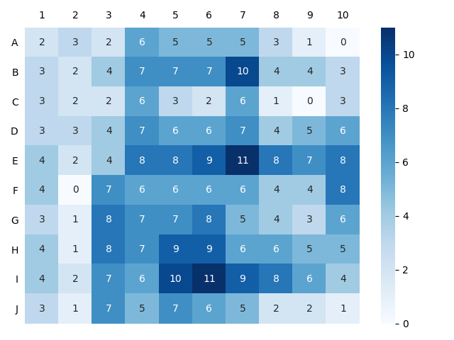

# Battleship Cheater

## About
The project was made because I have an electronic Battleship game and its code book it came with it. The book was full on preset grid-layouts and by hitting A1 - J10. 

This code takes all those grid-layouts and makes a heatmap of all the possible grid-layouts for any ship type and all of them summed together.  

# Installation

Use the package manager [pip](https://pip.pypa.io/en/stable/) to install [matplotlib](https://pypi.org/project/seaborn/), [seaborn](https://pypi.org/project/matplotlib/), and [numpy](https://pypi.org/project/numpy/).

```
pip install matplotlib
pip install seaborn
pip install numpy
```

## Example Graph



## Contributing
I am open to improvements. For changes please open an issue to discuss what you would like to change.